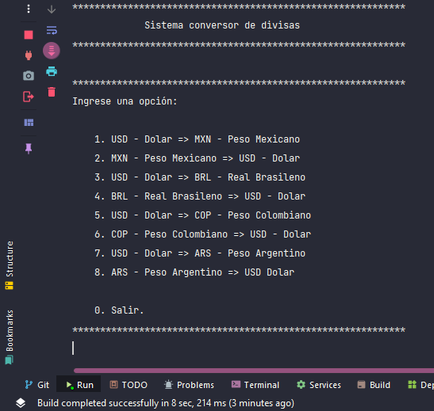

# Conversor de Divisas

## Tabla de contenido

- [El desafio](#el-desafio)
    - [Requisitos](#requisitos)
- [Screenshot](#screenshot)
- [Construido con](#construido-con)
- [Lo que aprendí](#lo-que-aprendí)
- [Autor](#autor)

## 📌 El desafio

### Descripcion
Segundo reto del curso ONE Oracle Next Education + Alura Latam

El reto consiste en desarrollar un conversor de monedas consumiendo la API de ExchangeRate-API

### Requisitos

- Debe mostrar las divisas posibles para convertir.
- El usuario debe elegir las divisas a convertir.
- El usuario debe ingresar la cantidad a convertir.
- Exibicion del resultado de cambio al usuario.
- Consumo de la API ExchangeRate-API.

## 📷 Screenshot

### Mostrando menu por consola

    

### Ingresando datos

    

### Mostrando el resultado de la conversión de divisas

    

### 🔧Construido con

    
    
    
    
    

### 📖 Lo que aprendí

Durante la realización de este reto aprendí a mejorar mi lógica de programación, de igual manera aprendi a hacer uso  de la bilbioteca Gson, la cual permite la serializacion y deserializacion entre objetos Java, reforce conocimientos sobre el consumo de apis.

## 😎 Autor
|  [ Javier Hernández](https://github.com/Javilh97)  |
| :---: |
